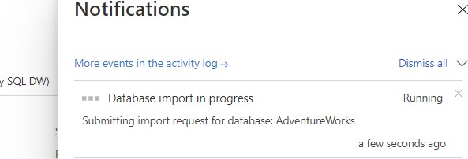
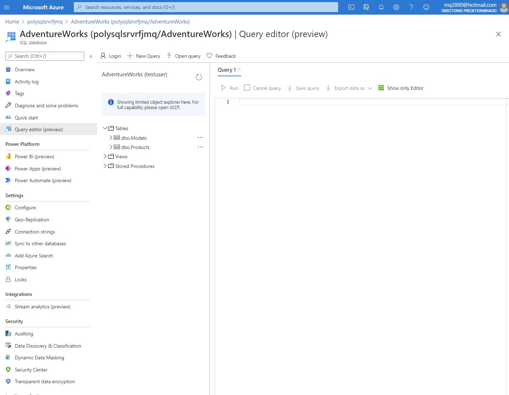
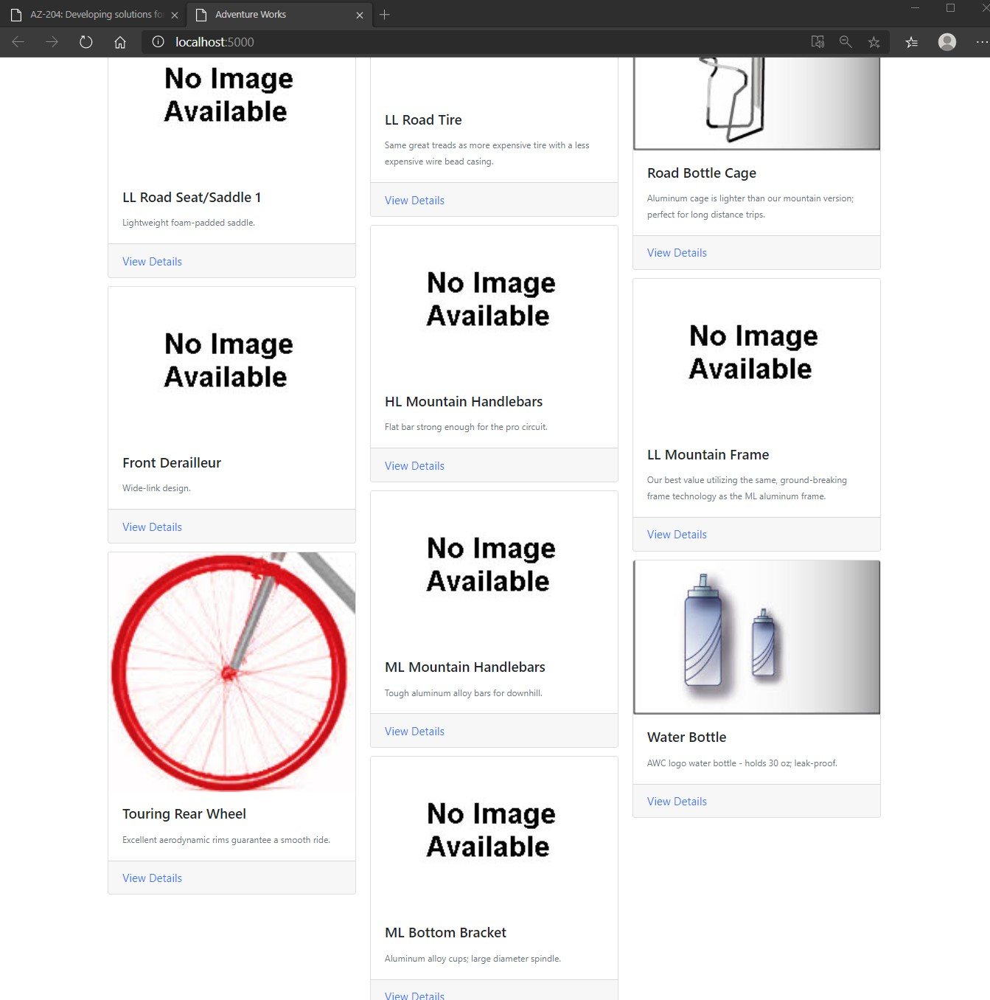
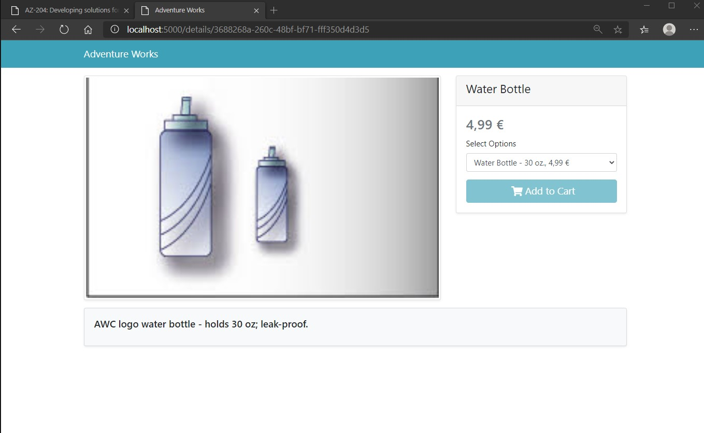
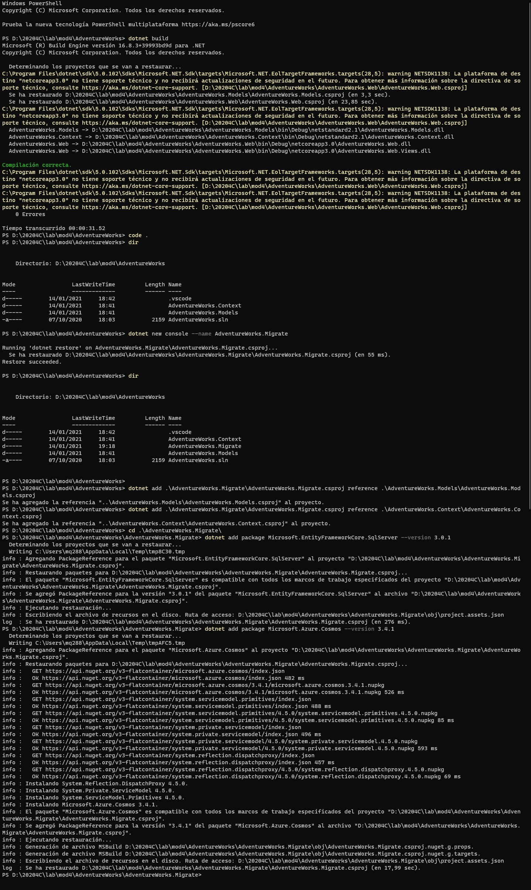
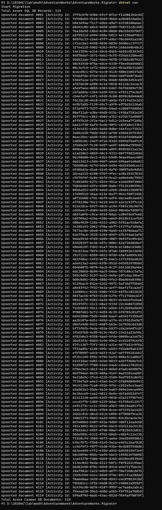
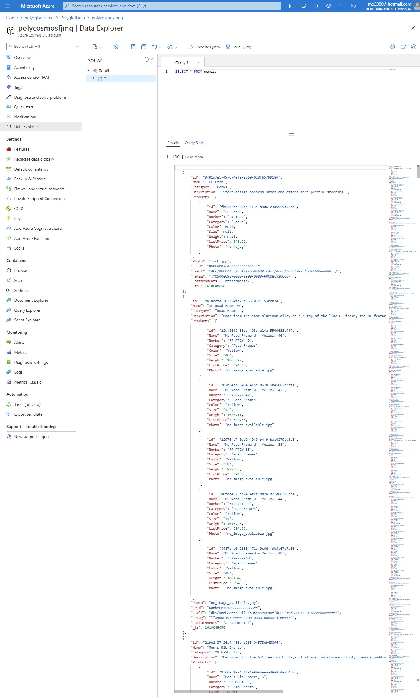
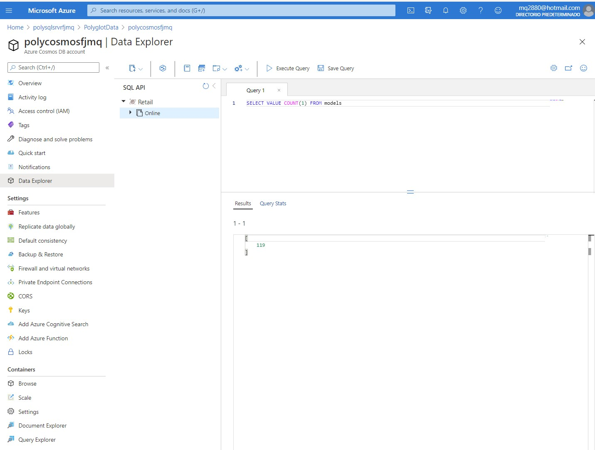
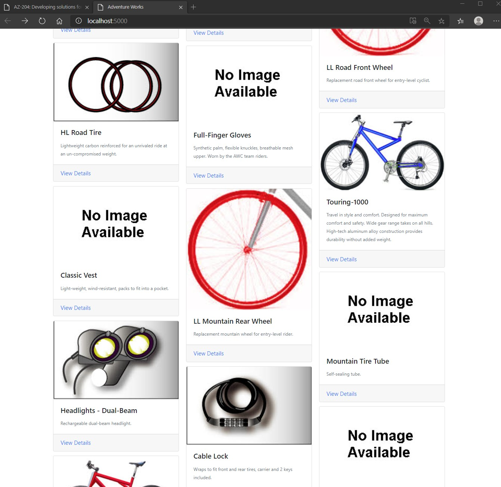
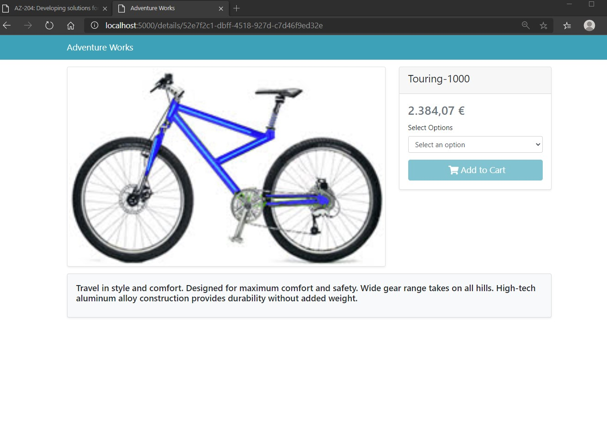

# Module 4: Extending ASP.NET Core HTTP Services

# Lab: Customizing the ASP.NET Core Pipeline

1. **Nombres y apellidos:** Francisco Javier Moreno Quevedo
2. **Fecha:** 17/01/2021
3. **Resumen del Ejercicio:**  Usar la inyeccion de dependecias,. Implementar un filtro de acción que almacene en caché el resultado del servicio. Implementar el middleware que devuelva el servicio.
4. **Dificultad o problemas presentados y como se resolvieron:** Ninguna

#### Exercise 1: Creating database resources in Azure

1. Creamos un **Azure SQL Database server (logical server)** 

   -   Server name: **polysqlsrvrfjmq***

   -   New resource group: **PolyglotData**

   -   Server admin login: **testuser**

   -   Password: **TestPa55w.rd**

   -   Location: **Central France**

   -   Allow Azure services to access server: **Yes**

2. Creamos una nueva cuenta de **Azure Cosmos DB**

   -   Account name: **polycosmos*[yourname]***

   -   Existing resource group: **PolyglotData**

   -   API: **Core (SQL)**

   -   Notebooks (Preview): **Off**

   -   Apply Free Tier Discount: **Do Not Apply**

   -   Location: **Central France**

   -   Account Type **Non-Production**

   -   Multi-region writes: **Disable**

3. Copiamos la  **PRIMARY CONNECTION STRING** de esta cuenta

4. Creamos una **Azure Storage account**

   -   Storage account name: **polystorfjmq**

   -   Existing resource group: **PolyglotData**

   -   Account kind: **StorageV2 (general purpose v2)**

   -   Location: **Central France**

   -   Replication: **Locally-redundant storage (LRS)**

   -   Performance: **Standard**

   -   Access tier (default): **Hot**

### Exercise 2: Import and validate data

1. Creamos un nuevo Container

   -   Name: **images**

   -   Public access level: **Blob (anonymous read access for blobs only)**

2. Guardamos **URL** de este container.

3. Subimos las imagenes de la carpeta  **Allfiles (F):\\Allfiles\\Labs\\04\\Starter\\Images**

4. Creamos un nuevo Container

   -   Name: **databases**

   -   Public access level: **Private (no anonymous access)**

5. Subimos el fichero bacpac  **AdventureWorks.bacpac**

6. Desde el servidor SQL Server Importamos la BBDD pulsando sobre** Import Database**

   - Storage account: **polystorfjmq**

   - Database backup blob: **databases\AdventureWorks.bacpac**

   - Database name: **AdventureWorks**

   - Server admin login: **testuser**

   - Password: **TestPa55w.rd
   
     






### Exercise 3: Open and configure a .NET web application

1. Abrimos el proyecto **AdventureWorks**.

2. Compilamos

   ```
   dotnet build
   ```

3. Añadimos en **AdventureWorks.Web/appsettings.json** la cadena de conexion

4. SUSTITUIMOS *Settings.BlobContainerUrl* por la URL de la **Azure Storage** blob container **images**

5. Ejecutamos

6. Comprobamos con Microsoft Edge browser.

   > **Note**: The URL is <http://localhost:5000>.


7. Buscamos **Water Bottle** 


#### 



### Exercise 4: Migrating SQL data to Azure Cosmos DB

1. Creamos un nuevo proyecto  **AdventureWorks.Migrate** 

   ```
   dotnet new console --name AdventureWorks.Migrate
   ```

1. Añadimos la referencia del proyecto **AdventureWorks.Models**

   ```
   dotnet add .\AdventureWorks.Migrate\AdventureWorks.Migrate.csproj reference .\AdventureWorks.Models\AdventureWorks.Models.csproj
   ```

1. Añadimos la referencia del proyecto **AdventureWorks.Context**

   ```
   dotnet add .\AdventureWorks.Migrate\AdventureWorks.Migrate.csproj reference .\AdventureWorks.Context\AdventureWorks.Context.csproj
   ```

1. Añadimos el paquete **Microsoft.EntityFrameworkCore.SqlServer** 

   ```
   dotnet add package Microsoft.EntityFrameworkCore.SqlServer --version 3.0.1
   ```

1. Añadimos el paquete **Microsoft.Azure.Cosmos** from NuGet:

   ```
   dotnet add package Microsoft.Azure.Cosmos --version 3.4.1
   ```

   

1. Compilamos

   ```
   dotnet build
   ```

   


1. Abrimos **AdventureWorks.Migrate/Program.cs** 

1. Borramos y añadimos el siguiente codigo

   ```
   using AdventureWorks.Context;
   using AdventureWorks.Models;
   using Microsoft.Azure.Cosmos;
   using Microsoft.EntityFrameworkCore;
   using System;
   using System.Collections.Generic;
   using System.Linq;
   using System.Threading.Tasks;
   
   public class Program
   {
       private const string sqlDBConnectionString = "";
       private const string cosmosDBConnectionString = "";
       
       public static async Task Main(string[] args)
       {
           await Console.Out.WriteLineAsync("Start Migration");
   
           using AdventureWorksSqlContext context = new AdventureWorksSqlContext(sqlDBConnectionString);
   
           List<Model> items = await context.Models
               .Include(m => m.Products)
               .ToListAsync<Model>();
   
           await Console.Out.WriteLineAsync($"Total Azure SQL DB Records: {items.Count}");
           
           using CosmosClient client = new CosmosClient(cosmosDBConnectionString);
   
           Database database = await client.CreateDatabaseIfNotExistsAsync("Retail");
   
           Container container = await database.CreateContainerIfNotExistsAsync("Online",
               partitionKeyPath: $"/{nameof(Model.Category)}",
               throughput: 1000
           );
   
           int count = 0;
           foreach (var item in items)
           {
               ItemResponse<Model> document = await container.UpsertItemAsync<Model>(item);
               await Console.Out.WriteLineAsync($"Upserted document #{++count:000} [Activity Id: {document.ActivityId}]");
           }
   
           await Console.Out.WriteLineAsync($"Total Azure Cosmos DB Documents: {count}");
       }
   }
   ```

1. Actualizo el **sqlDBConnectionString** 

1. Actualizo **cosmosDBConnectionString** 

1. Compilamos y ejecutamos

   ```
   dotnet build
   dotnet run
   ```

   > 


6. Vamos a la cuenta de Cosmos DB **polycosmosfjmq** 

7. Abrimos el Data Explorer panel y en new **SQL query**, escribimos

   ```
   SELECT * FROM models
   SELECT VALUE COUNT(1) FROM models
   
   ```

8. Comprobamos el resultado
   
   > 




### Exercise 5: Accessing Azure Cosmos DB by using .NET

1. Abrimos el proyecto **AdventureWorks.Context** 

   ```
   cd .\AdventureWorks.Context\
   ```

1. Añadimos el paquete **Microsoft.Azure.Cosmos** 

   ```
   dotnet add package Microsoft.Azure.Cosmos --version 3.4.1
   ```

1. Compilamos

   ```
   dotnet build
   ```

1. Creamos el fichero **AdventureWorks.Context/AdventureWorksCosmosContext.cs** y añadimos

   

1. ```
   using AdventureWorks.Models;
   using Microsoft.Azure.Cosmos;
   using Microsoft.Azure.Cosmos.Linq;
   using System;
   using System.Collections.Generic;
   using System.Linq;
   using System.Threading.Tasks;
   
   namespace AdventureWorks.Context
   {
       public class AdventureWorksCosmosContext : IAdventureWorksProductContext
       {
           private readonly Container _container;
   
   		public AdventureWorksCosmosContext(string connectionString, string database = "Retail", string container = "Online")
           {
           _container = new CosmosClient(connectionString)
           .GetDatabase(database)
           .GetContainer(container);
           }
   
   		public async Task<Model> FindModelAsync(Guid id)
           {
               var iterator = _container.GetItemLinqQueryable<Model>()
                   .Where(m => m.id == id)
                   .ToFeedIterator<Model>();
   
               List<Model> matches = new List<Model>();
               while (iterator.HasMoreResults)
               {
                   var next = await iterator.ReadNextAsync();
                   matches.AddRange(next);
               }
   
               return matches.SingleOrDefault();
           }
           public async Task<Product> FindProductAsync(Guid id)
           {
               string query = $@"SELECT VALUE products
                                   FROM models
                                   JOIN products in models.Products
                                   WHERE products.id = '{id}'";
   
               var iterator = _container.GetItemQueryIterator<Product>(query);
   
               List<Product> matches = new List<Product>();
               while (iterator.HasMoreResults)
               {
                   var next = await iterator.ReadNextAsync();
                   matches.AddRange(next);
               }
   
               return matches.SingleOrDefault();
           }
   	}
   }
   ```

1. Compilamos

   ```
   dotnet build
   ```

   > 


1.  Abrimos el **AdventureWorks.Web/appsettings.json** reemplazamos el *ConnectionStrings.AdventureWorksCosmosContext* por la **PRIMARY CONNECTION STRING** de la cuenta Cosmos DB 

1.  Abrimos **AdventureWorks.Web/Startup.cs** file in Visual Studio Code.

1. Reemplazamos el  **ConfigureProductService** por

   ```
   public void ConfigureProductService(IServiceCollection services)
   {
       services.AddScoped<IAdventureWorksProductContext, AdventureWorksCosmosContext>(provider =>
               new AdventureWorksCosmosContext(
                   _configuration.GetConnectionString(nameof(AdventureWorksCosmosContext))
               )
       );
   }
   ```

1. Ejecutamos

1. ```
dotnet run
   ```
   
   

1. Abrimos the Microsoft Edge browser en **localhost** on port **5000**.

   

1. Buscamos **Touring-1000** y pulsamos sobre **View Details**.

   

   


